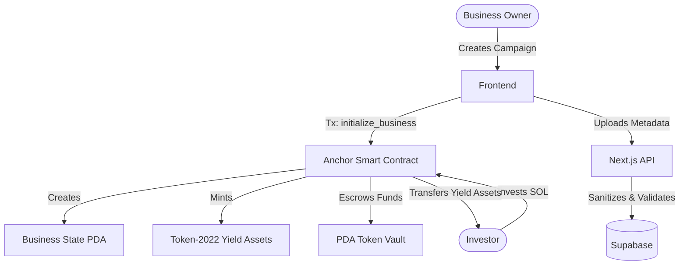

# Anchor Capital — Institutional On-Chain Equity Raising

Anchor Capital is a decentralized investment platform built on Solana. It enables MSMEs to tokenize unpaid invoices and raise capital by offering fractional yield assets (Token-2022) to investors. The platform handles escrow, tokenization, automated dividend distribution, and auto-refunds in a completely trustless, on-chain manner.

## Architecture



## Tech Stack

| Layer | Technologies |
|---|---|
| **Smart Contract** | Solana, Anchor (v0.30.1), Rust |
| **Token Standard** | Token-2022 (Transfer Fees) |
| **Frontend** | Next.js 14, React 19, TypeScript |
| **Web3 Integration** | @solana/web3.js, @coral-xyz/anchor, Wallet Adapter |
| **Database/API** | Supabase (PostgreSQL), Upstash Redis (Rate Limiting) |
| **Testing** | Jest (Frontend), Mocha/Chai (Smart Contract) |

## Key Features

- **Trustless Escrow:** Investor funds are securely held in a PDA vault until the funding goal is reached.
- **Auto-Refunds:** If a campaign fails to reach its goal before the funding deadline, the contract allows anyone to trigger an auto-close, enabling investors to claim their refunds.
- **Automated Dividend Distribution:** Businesses can distribute profits directly to token holders proportional to their equity stake.
- **Cryptographic Authentication:** API routes verify wallet ownership using `tweetnacl` cryptographic signatures to prevent unauthorized metadata modifications.

## Setup Instructions

### 1. Smart Contract

```bash
# Install dependencies and build the Anchor program
yarn install
anchor build

# Deploy to localnet or devnet
anchor deploy
```

### 2. Frontend

```bash
cd frontend

# Install dependencies
npm install

# Set up environment variables
cp .env.example .env.local
# (Add your Supabase and Upstash credentials)

# Start the development server
npm run dev
```

## License

MIT License
